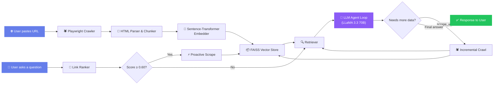

<div align="center">

# 🌐 AI Browser Agent

### _Turn any webpage into a conversational knowledge base — powered by Agentic RAG_

[](https://python.org)
[](https://fastapi.tiangolo.com)
[](https://gradio.app)
[](https://groq.com)
[](https://faiss.ai)
[](https://playwright.dev)
[](LICENSE)

<br />

<p align="center">
  <strong>Paste a URL → Agent crawls, parses & embeds it → Ask anything about the page in natural language</strong>
</p>

<p align="center">
  <em>The agent autonomously decides when to follow and scrape internal links to find complete answers — no manual browsing required.</em>
</p>

---

</div>

## ✨ Key Features

| Feature | Description |
|:--|:--|
| 🕷️ **Headless Crawling** | Uses Playwright with Chromium to render JS-heavy pages — sees what a real browser sees |
| 🧠 **Agentic RAG** | The LLM autonomously decides when to scrape additional internal links to complete its answer |
| ⚡ **Proactive Scraping** | Links are semantically ranked against the question — high-relevance pages are pre-fetched before the LLM even asks |
| 🔍 **Vector Search** | FAISS-powered similarity search over sentence-transformer embeddings (`all-MiniLM-L6-v2`) |
| 💬 **Conversational Memory** | Multi-turn chat with compact history to maintain context across follow-up questions |
| 🗂️ **Smart Chunking** | Sentence-boundary-aware text chunking with configurable overlap for optimal retrieval |
| 🚀 **Blazing Fast Inference** | LLaMA 3.3 70B via Groq API — sub-second LLM responses |
| 🖥️ **Polished UI** | Modern Gradio interface with gradient header, live status, and an integrated chatbot |

---

## 🏗️ Architecture



### How the Agent Loop Works

1. **URL Processing** — Playwright renders the page → BeautifulSoup extracts clean text → text is chunked with sentence-boundary overlap → chunks are embedded and stored in FAISS.

2. **Question Answering** — Internal links are ranked by cosine similarity to the question. If the top link scores ≥ 0.60, it's proactively scraped. Relevant chunks are retrieved and sent to the LLM.

3. **Autonomous Tool Calling** — The LLM can emit a JSON block `{"action": "scrape_url", "url": "..."}` to follow internal links. The agent loop crawls the new page, embeds it, retrieves fresh chunks, and re-prompts the LLM — up to 5 iterations — until a complete answer is formed.

---

## 📁 Project Structure

```
AI-Browser-Agent/
├── backend/
│   ├── main.py                    # FastAPI app — /process, /chat, /health endpoints
│   ├── crawler/
│   │   └── playwright_crawler.py  # Headless Chromium page rendering
│   ├── parser/
│   │   └── html_parser.py         # HTML → clean text, chunking, link extraction
│   ├── embedding/
│   │   └── embedder.py            # Sentence-Transformer (all-MiniLM-L6-v2)
│   ├── vectorstore/
│   │   └── faiss_store.py         # FAISS IndexFlatL2 vector store
│   ├── llm/
│   │   └── groq_client.py         # Groq API client — LLaMA 3.3 70B
│   └── services/
│       ├── pipeline.py            # Orchestrates crawl → parse → embed → store
│       ├── retriever.py           # Query embedding + FAISS similarity search
│       ├── link_ranker.py         # Cosine-similarity link ranking
│       ├── chat_memory.py         # Sliding-window conversation history
│       └── cache_manager.py       # URL text cache to avoid re-scraping
├── frontend/
│   ├── app.py                     # Gradio app entry point
│   ├── ui.py                      # UI layout, theme, and custom CSS
│   └── api_client.py              # HTTP client to communicate with backend
├── requirements.txt
├── .env                           # GROQ_API_KEY (not tracked by git)
└── .gitignore
```

---

## 🚀 Quick Start

### Prerequisites

- **Python 3.10+**
- A free **[Groq API Key](https://console.groq.com/keys)**

### 1. Clone the repository

```bash
git clone https://github.com/<your-username>/AI-Browser-Agent.git
cd AI-Browser-Agent
```

### 2. Create and activate a virtual environment

```bash
# Windows
python -m venv venv
.\venv\Scripts\activate

# macOS / Linux
python -m venv venv
source venv/bin/activate
```

### 3. Install dependencies

```bash
pip install -r requirements.txt
playwright install chromium
```

### 4. Configure your API key

Create a `.env` file in the project root:

```env
GROQ_API_KEY=your_groq_api_key_here
```

### 5. Start the backend

```bash
uvicorn backend.main:app --reload
```

The API will be available at `http://localhost:8000`. You can visit `http://localhost:8000/docs` for the interactive Swagger documentation.

### 6. Start the frontend

Open a **new terminal** (keep the backend running):

```bash
python frontend/app.py
```

The Gradio UI will open at `http://localhost:7860`.

---

## 🎮 Usage

| Step | Action |
|:--:|:--|
| **1** | Paste any URL into the input field and click **"Process URL"** |
| **2** | Wait for the agent to crawl, parse, embed, and summarize the page |
| **3** | Review the summary and discovered internal links |
| **4** | Start asking questions in the chat — the agent will autonomously scrape deeper pages when needed |

### Example Queries

```
🔹 "What are the main services offered on this page?"
🔹 "List all available AWS courses."
🔹 "Give me the full details about the Python training program."
🔹 "What certifications are mentioned on the site?"
```

---

## 🔌 API Reference

### `POST /process`

Process and index a webpage.

```json
// Request
{ "url": "https://example.com" }

// Response
{
  "status": "success",
  "num_chunks": 42,
  "title": "Example Page Title",
  "summary": "AI-generated summary of the page...",
  "internal_links": [
    { "url": "https://example.com/about", "text": "About Us" }
  ]
}
```

### `POST /chat`

Ask a question about the processed page.

```json
// Request
{ "question": "What products are listed?" }

// Response
{
  "answer": "The page lists the following products: ...",
  "source_url": "https://example.com/products"
}
```

### `GET /health`

Health check endpoint.

```json
{
  "status": "healthy",
  "url_processed": true,
  "current_url": "https://example.com",
  "vectors_stored": 42
}
```

---

## 🧰 Tech Stack

| Layer | Technology | Purpose |
|:--|:--|:--|
| **LLM** | LLaMA 3.3 70B via [Groq](https://groq.com) | Ultra-fast chat completions and summarization |
| **Embeddings** | [all-MiniLM-L6-v2](https://huggingface.co/sentence-transformers/all-MiniLM-L6-v2) | Lightweight 384-dim sentence embeddings |
| **Vector Store** | [FAISS](https://github.com/facebookresearch/faiss) (IndexFlatL2) | Exact L2 similarity search |
| **Crawler** | [Playwright](https://playwright.dev) (Chromium) | Headless browser rendering of JS pages |
| **Parser** | [BeautifulSoup](https://beautiful-soup-4.readthedocs.io) + lxml | HTML → clean text extraction |
| **Backend** | [FastAPI](https://fastapi.tiangolo.com) + Uvicorn | Async REST API |
| **Frontend** | [Gradio](https://gradio.app) | Interactive chat UI |
| **HTTP Client** | [HTTPX](https://www.python-httpx.org/) | Async-ready frontend ↔ backend communication |

---

## ⚙️ Configuration

Key constants can be tuned in `backend/main.py`:

| Constant | Default | Description |
|:--|:--:|:--|
| `INITIAL_RETRIEVAL_K` | `8` | Number of chunks retrieved before any scrape |
| `POST_SCRAPE_RETRIEVAL_K` | `12` | Number of chunks retrieved after a scrape |
| `PROACTIVE_SCRAPE_THRESHOLD` | `0.60` | Cosine similarity threshold to trigger auto-scraping |
| `MAX_CONTEXT_CHARS` | `12,000` | Max context window sent to the LLM |
| `chunk_size` | `800` | Character size of each text chunk |
| `overlap` | `100` | Overlap characters between consecutive chunks |

---

## 🤝 Contributing

Contributions are welcome! Feel free to:

1. 🍴 Fork the repository
2. 🌿 Create a feature branch (`git checkout -b feature/amazing-feature`)
3. 💾 Commit your changes (`git commit -m 'Add amazing feature'`)
4. 📤 Push to the branch (`git push origin feature/amazing-feature`)
5. 🔃 Open a Pull Request

---

## 📄 License

This project is open source and available under the [MIT License](LICENSE).

---

<div align="center">

**Built with ❤️ by [Andrés Turriza](https://github.com/AndyTue)**

<sub>If you found this project useful, consider giving it a ⭐</sub>

</div>
